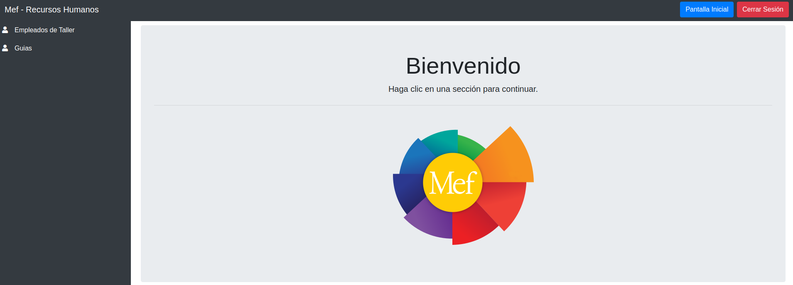
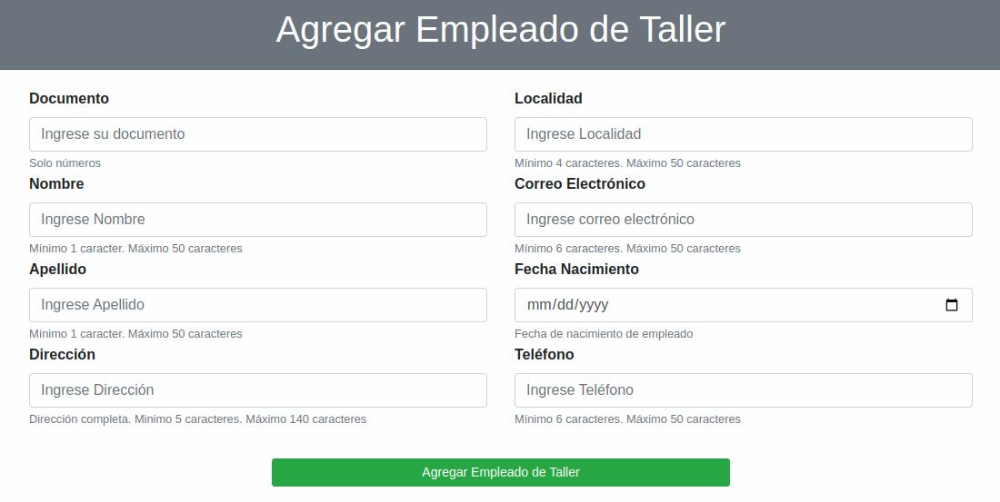
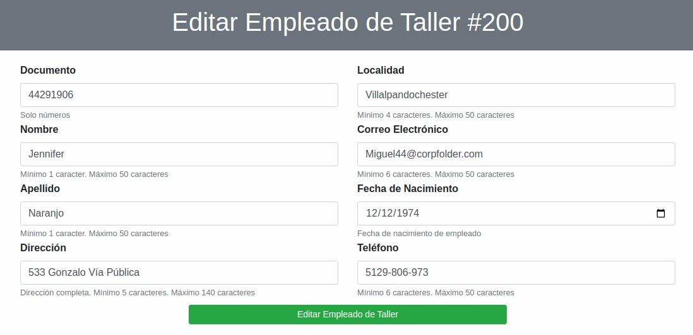
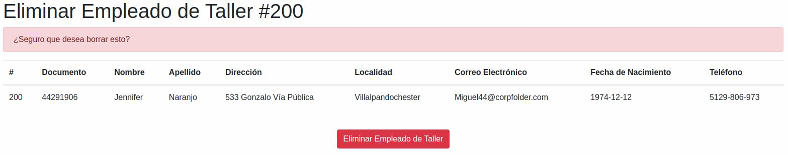
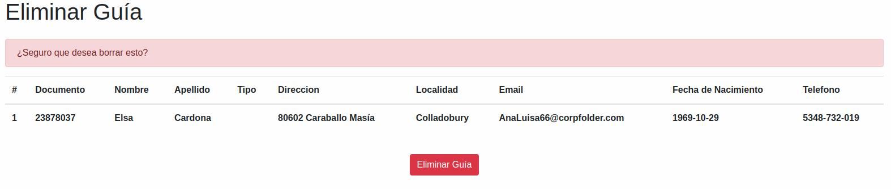

Gestión de Jefe de Recursos Humanos
===================================

Bienvenido a la Gestión de Recursos Humanos. En esta sección usted podrá ver, crear, editar y eliminar a los guías y empleados del museo.

Puede seleccionar el símbolo 'lápiz' para poder editar su información general.

Puede seleccionar el símbolo 'basura' para poder eliminar un elemento.

Si desea agregar un elemento nuevo, haga click en el símbolo '+'. 

Si desea exportar un el presente listado puede hacerlo seleccionando entre 'Excel', 'PDF', o 'CSV'

Empleados de Taller
___________________

**Pantalla Principal / Listado**

Bienvenido al listado de Empleados de Taller. 
El presente listado le presentará un detalle de todos los emplados en la base de datos con sus detalles.
Cuenta con una herramienta de búsqueda (lupa) con la que podrá buscar al empleado de taller de acuerdo 
al documento del empleado, nombre o apellido, Dirección, etc.
También tiene flechas de ordenación al lado del titulo de cada columna que le permitirá ordenar los elementos 
de acuerdo al atributo de dicha columna de forma ascendente o descendete.

**Agregar Empleado**

Esta es la sección dedicada al alta de los empleados.

Consiste en asignarle:

* Su número de documento (no se utilizan los puntos).

* Nombre, máximo de 50 caracteres.

* Apellido, máximo de 50 de caracteres.

* Dirección donde vive, máximo 140 caracteres.

* Localidad donde vive, máximo 50 de caracteres.

* Correo electrónico, maximo de 50 caracteres.

* Fecha de Nacimiento, solo estarán habilitadas fechas de modo que el empleado sea mayor de edad.

* Número de telefono.

**Modificación**

Esta es la sección dedicada la edición de un empleado seleccionado.

Consiste en poder modificar:

* Su número de documento (no se utilizan los puntos).

* Nombre, máximo de 50 caracteres.

* Apellido, máximo de 50 de caracteres.

* Dirección donde vive, máximo 140 caracteres.

* Localidad donde vive, máximo 50 de caracteres.

* Correo electrónico, maximo de 50 caracteres.

* Fecha de Nacimiento, solo estarán habilitadas fechas de modo que el empleado sea mayor de edad.

* Número de telefono.

**Eliminar Empleado**

Esta es la sección dedicada a eliminar empleados.

Seleccione al empleado que desee eliminar y aparecerá una mensaje de confirmación. Si acepta, se eliminará al empleado, si cancela, no se eliminará y volverá al listado de empleados.

Guías
_____

**Pantalla Principal / Listado**

Bienvenido al listado de Guías. 
El presente listado le presentará un detalle de todos los guías en la base de datos con sus detalles.
Cuenta con una herramienta de búsqueda (lupa) con la que podrá buscar al guía de acuerdo 
a el nombre del guía, su documento, dirección, etc.
También tiene flechas de ordenación al lado del titulo de cada columna que le permitirá ordenar los elementos 
de acuerdo al atributo de dicha columna de forma ascendente o descendete.

**Alta**

Esta es la sección dedicada al alta de los guías.

Consiste en asignarle:

* Su número de documento (no se utilizan los puntos).

* Nombre, máximo de 50 caracteres.

* Apellido, máximo de 50 de caracteres.

* Dirección donde vive, máximo 140 caracteres.

* Localidad donde vive, máximo 50 de caracteres.

* Correo electrónico, maximo de 50 caracteres.

* Fecha de Nacimiento, solo estarán habilitadas fechas de modo que el empleado sea mayor de edad.

* Número de telefono.

* Horario Laboral (Diurno/Nocturno)

* Días Laborales (de Lunes a Viernes/Franquero)

* Idiomas que habla de una lista precargada (podrá seleccionar más de un idioma con 'shift' y haciendo click en los idiomas).

.. image:: ../images/rrhh/guias/AgregarGuia.jpg
   :width: 800

**Modificación**
Esta es la sección dedicada la edición de un guía seleccionado.

Consiste en poder modificar:

* Su número de documento (no se utilizan los puntos).

* Nombre, máximo de 50 caracteres.

* Apellido, máximo de 50 de caracteres.

* Dirección donde vive, máximo 140 caracteres.

* Localidad donde vive, máximo 50 de caracteres.

* Correo electrónico, maximo de 50 caracteres.

* Fecha de Nacimiento, solo estarán habilitadas fechas de modo que el empleado sea mayor de edad.

* Número de telefono.

* Horario Laboral (Diurno/Nocturno)

* Días Laborales (de Lunes a Viernes/Franquero)

* Idiomas que habla de una lista precargada (podrá seleccionar más de un idioma con 'shift' y haciendo click en los idiomas).

**Baja**

Esta es la sección dedicada a eliminar guías.

Seleccione al guía que desee eliminar y aparecerá una mensaje de confirmación. Si acepta, se eliminará al guía, si cancela, no se eliminará y volverá al listado de guías.

